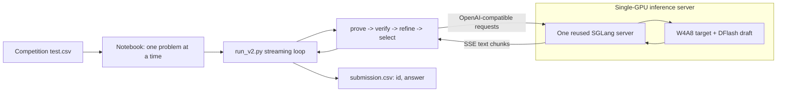
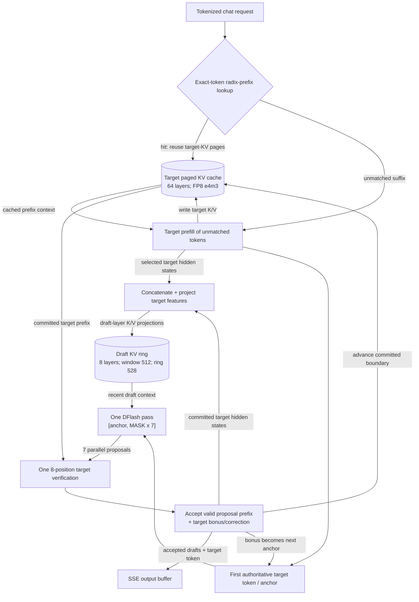

# DFlash Inference and KV-Cache Architecture

This describes the exact pipeline configured by `submission-32b-fix4.ipynb`,
including both the Proof Pilot orchestration and one request inside SGLang.

## Direct answer

**Yes, our DFlash inference uses KV caching.** DFlash does not replace the KV
cache. It adds a second, smaller KV cache for the draft model beside the target
model's normal KV cache.

There are three related but different pieces of state:

1. **Target KV cache:** the authoritative 64-layer model's paged attention
   memory for the active sequence.
2. **Draft KV ring:** the 8-layer DFlash model's private, bounded attention
   memory for the active sequence.
3. **Radix/prefix cache:** an index that lets later requests reuse compatible
   target-KV pages. It is not a third copy of all K/V tensors.

```text
Target KV  = memory used by the model that decides the answer
Draft KV   = memory used by the model that guesses several next tokens
Radix      = cross-request lookup/reuse of target-KV pages
DFlash     = draft -> target verification -> commit loop
```

## 1. End-to-end notebook pipeline

The notebook starts one SGLang server and reuses it for every model call and
problem. `run_v2.py` handles `test.csv` one problem at a time, while each
problem creates many prove, verify, refine, and select requests.



The notebook starts 6 provers, launches 3 verifiers per candidate, refines from
up to 4 inputs, and sends the top 4 candidates to 5 selectors. Its request
concurrency is 12, with at most 6 generation calls active. Keeping one server
alive across these calls is what makes radix-prefix reuse useful.

The rest of this document zooms into one completion request.

## 2. Components inside one DFlash request



Target K/V and draft K/V are not interchangeable:

- Target K/V comes from the target model's attention projections.
- Draft K/V comes from selected **target hidden states**, fused and then passed
  through each draft layer's K/V projections.

The notebook draft checkpoint captures target layer outputs
`[1, 10, 18, 27, 35, 44, 52, 61]`. Their eight 5120-dimensional features are
fused into one 5120-dimensional draft context representation. The temporary
hidden-state buffer is then cleared; the persistent result is draft K/V, not a
third hidden-state cache.

## 3. Prefill initializes both model caches

For a request without a prefix hit:

1. The 64-layer target processes the prompt and writes target K/V.
2. It captures the configured intermediate target-layer outputs.
3. DFlash fuses those features and materializes K/V for all 8 draft layers.
4. Those draft entries go into this request's bounded ring.
5. The target produces the first authoritative token, used as the first anchor.

For a request with a radix-prefix hit:

1. SGLang reuses target-KV pages for the exact compatible token prefix.
2. The target prefills only the unmatched suffix.
3. Hidden features exist only for tokens recomputed in that suffix.
4. The draft ring may therefore start cold for the reused prefix and warm during
   the first decode cycles.

A cold draft ring can reduce acceptance and speed. It cannot change correctness,
because the target verifies every token before it becomes authoritative.

## 4. One exact DFlash cycle

The notebook sets `BLOCK=8` and `NUM_DRAFT=8`. Here that means an
**8-position verification block**, not eight independent guesses:

```text
position 0    : one already-authoritative anchor token
positions 1-7 : seven MASK positions -> seven DFlash proposals
```

This matches the H200 result: 63 verification cycles generated
`63 x 7 = 441` draft proposals.

```mermaid
sequenceDiagram
    participant S as Scheduler
    participant DK as Draft KV ring
    participant D as 8-layer DFlash draft
    participant TK as Target KV cache
    participant T as 64-layer target
    participant O as Output stream

    loop Until EOS, stop, or token limit
        S->>S: Reserve target-KV slots for 8 verify positions
        S->>D: [authoritative anchor, MASK x 7]
        DK-->>D: Recent draft context, at most 512 positions
        D-->>S: Proposals d1..d7 in one parallel pass
        S->>T: Verify [anchor, d1, ..., d7] in one causal pass
        TK-->>T: Read committed target-prefix K/V
        T-->>S: Target logits + selected hidden features
        S->>S: Accept valid prefix; choose target bonus/correction
        S->>TK: Commit authoritative prefix; tail remains uncommitted
        S->>DK: Project committed target features into draft K/V
        S-->>O: Emit accepted proposals + one target-derived token
        S->>S: Carry target token as next anchor
    end
```

The notebook uses temperature 1.0 and top-p 0.95, so its patched worker uses a
sampling-correct acceptance path. With greedy decoding, it accepts consecutive
draft tokens matching the target. In both cases, the target remains
authoritative.

The target physically writes provisional K/V for all eight verification inputs.
Only `accepted drafts + 1` advances the logical committed boundary. Rejected
target slots remain outside the sequence and are later reused, overwritten, or
freed. Draft rows for rejected positions likewise become unreachable and are
overwritten.

### Concrete cache state

```text
Before cycle
  visible history : prompt ... a        (a was chosen by target)
  target KV       : prompt ...          (a is the one-token-lag anchor)
  draft KV ring   : target-conditioned K/V for recent <=512 positions

Draft once
  input           : [a] [MASK] [MASK] [MASK] [MASK] [MASK] [MASK] [MASK]
  proposals       : [a] [ d1 ] [ d2 ] [ d3 ] [ d4 ] [ d5 ] [ d6 ] [ d7 ]

Target verifies
  block           : [a] [ d1 ] [ d2 ] [ d3 ] [ d4 ] [ d5 ] [ d6 ] [ d7 ]
  example         : d1,d2 accepted; target supplies authoritative token b

After cycle
  emitted         : d1 d2 b
  target KV       : prompt ... a d1 d2
  draft KV ring   : projected target features for committed input positions
  next anchor     : b                    (its K/V is written next cycle)
```

## 5. What is stored where

| State | What it contains | Scope/lifetime | Notebook behavior |
|---|---|---|---|
| Target KV | K/V from all target attention layers | Active request; eligible pages may persist through radix | Paged FP8 e4m3, 64 layers |
| Draft KV ring | Draft-layer K/V derived from fused target features, plus in-flight state | Private to one active request | FP8 e4m3, 8 layers, logical window 512, physical ring 528 |
| Radix cache | Exact-token prefix index and ownership of reusable target-KV pages | Shared across compatible requests until eviction | Enabled by `DISABLE_RADIX=0`; does not restore draft KV |
| Selected target hidden states | Inputs used to construct draft K/V | Transient during target prefill/verify | Fused/projected, then cleared |
| Model weights | Parameters used to compute K/V and logits | Server lifetime | Target W4A8; draft INT4 MLP with BF16 attention weights |
| CUDA graphs | Captured execution plans/static buffers | Server lifetime | Performance machinery, not K/V |

Both target and draft KV pools inherit `--kv-cache-dtype fp8_e4m3`. The draft's
attention weights and projection computation remain BF16 while only its MLP
weights are INT4. Compute/weight dtype does not determine the stored KV dtype.

## 6. Why the two caches have different shapes

### Target KV

The 64 target layers comprise 48 sliding-attention and 16 full-attention layers:

```text
Target layer pattern, repeated 16 times:
  [SWA 4096] [SWA 4096] [SWA 4096] [FULL HISTORY]
```

- Full-attention layers preserve authoritative long-range history.
- SWA layers retain their recent 4096-token windows and periodically evict old
  entries.
- `SWA_RATIO=0.2` sizes the full-attention KV pool. It does not mean that 20%
  of layers are full-attention layers.
- The target owns the authoritative cache and supports a 200,000-token context.

### Draft KV

All 8 draft layers use a 512-token sliding window:

```text
draft slot = request_region_start + (global_position mod 528)

logical attention history : most recent 512 positions
speculative slack         : 2 x block size = 16 positions
physical ring region      : 512 + 16 = 528 slots
```

`SGLANG_DFLASH_DRAFT_RING_QUOTA=4` overprovisions request regions for overlap
scheduler safety; it does not enlarge the 512-token attention window.

A 200k target context therefore does not require a 200k draft cache. Missing old
draft context can hurt acceptance, never target-verified correctness.

## 7. Exact notebook configuration

| Component | `submission-32b-fix4.ipynb` |
|---|---|
| GPU/server | One RTX PRO 6000 Blackwell, TP=1 |
| Mode | `CONFIG=w4a8-dflash` |
| Target | 64-layer Olmo3Sink GPTQ INT4, Humming W4A8 execution |
| Target attention | Triton, 40 query heads, 8 KV heads, hybrid SWA/full |
| Draft | 8 layers; INT4 compressed-tensors MLP, BF16 attention weights |
| Shared model parts | Draft uses target input embedding and target LM head |
| Target and draft KV | FP8 e4m3 |
| Target context/window | 200,000 context; SWA window 4096 |
| Draft window/ring | 512 logical; 528 physical slots per request region |
| DFlash block | Effective 8, overriding checkpoint-native 11 |
| Guesses per cycle | 7; position zero is the authoritative anchor |
| Radix prefix cache | Enabled (`DISABLE_RADIX=0`) |
| Chunked prefill/graphs | 2048; buckets 256, 1024, 2048 |
| Max running requests | 48 |
| SSE interval | 16 output tokens; HTTP buffering only |
| Full-attention pool ratio | 0.2 |
| Draft-ring quota | 4 |

These are independent quantization axes:

```text
W4A8 target       = target matrix-multiplication weights/activations
INT4 draft MLP    = draft MLP weight representation
FP8 KV            = stored attention memory for both models
```

## 8. Notebook versus the H200 KV experiment

| Behavior | Submission notebook | `kv_cache_experiment.py` |
|---|---|---|
| Target weights | GPTQ/Humming W4A8 | Local BF16 target |
| Draft weights | INT4 MLP | Local BF16 draft |
| Target KV | FP8 e4m3 | FP8 e4m3 |
| Draft KV | FP8 ring, window 512 | FP8 ring, window 512 |
| Radix cache | Enabled | Disabled |
| DFlash block | 8 | 8 |
| Target pool ratio | 0.2 | 0.1 |
| Max requests | 48 | 1 |
| Stream interval | 16 | 1 |

`disable_radix_cache=True` disables cross-request prefix reuse only. It does
**not** disable either active-request KV cache.

The experiment's full-reprefill arm makes fresh `max_new_tokens=1` requests.
Each request transiently writes target KV during prefill, emits one token, and
discards the state before reaching DFlash. That is why its 244 speculative
metric dictionaries are empty. The continuous reuse arm is the one that ran 63
real DFlash verification cycles.

## 9. Common misconceptions

- **DFlash replaces KV:** false; it depends on target KV and adds draft KV.
- **Radix disabled means all KV disabled:** false; only cross-request reuse is
  disabled.
- **Draft ring equals prefix cache:** false; it is private per active request.
- **A prefix hit warms both caches:** false; it restores target KV immediately,
  while draft KV may warm during decode.
- **Block 8 means eight guesses:** false here; it is one anchor plus seven
  guesses, with a target bonus/correction.
- **The draft decides output:** false; the target verifies every emitted token.
- **Stream interval 16 is a model block size:** false; it only batches SSE.
- **The 32B draft is another 32B model:** false; it is target-matched but has 8
  layers with the target's 5120 width and 40/8 Q/KV head layout.

## 10. Lifecycle summary

```text
Server start
  load target and draft weights
  allocate target KV pool and draft KV pool
  capture CUDA graphs

Request start
  radix may attach reusable target-KV pages
  target prefills unmatched suffix
  selected target hidden states initialize recent draft K/V

Each DFlash cycle
  draft KV -> 7 parallel proposals
  target KV -> one 8-position verification
  commit accepted/authoritative target state
  project committed target features into draft ring
  buffer/stream output

Request end
  target pages may enter radix or return to pool
  private draft request/ring mapping is released

Server stays alive
  later Proof Pilot calls may reuse exact compatible target prefixes
```

## Relevant workspace sources

- `submission-32b-fix4.ipynb`, especially cells 0, 1, 5, 8, 9, and 11.
- [`sglang_patches/dflash_worker_v2_ring.py`](sglang_patches/dflash_worker_v2_ring.py):
  draft worker, ring, prefill materialization, verification, and commit flow.
- [`sglang_patches/dflash_info_v2_swa_evict.py`](sglang_patches/dflash_info_v2_swa_evict.py):
  speculative target-slot reservation and SWA eviction.
- [`sglang_patches/olmo2_sink_dflash.py`](sglang_patches/olmo2_sink_dflash.py):
  hybrid target and selected hidden-state capture.
- [`sglang_patches/dflash_sink.py`](sglang_patches/dflash_sink.py): target-matched
  8-layer draft.
- [`kv-cache-and-prefix-caching.md`](kv-cache-and-prefix-caching.md): KV and
  prefix caching from first principles.
- [`kv_cache_experiment.py`](kv_cache_experiment.py): H200 reuse versus
  full-reprefill methodology.

> **Invariant:** DFlash does not replace KV caching. It adds a second bounded
> draft KV cache beside the target KV cache, and the target remains
> authoritative.
