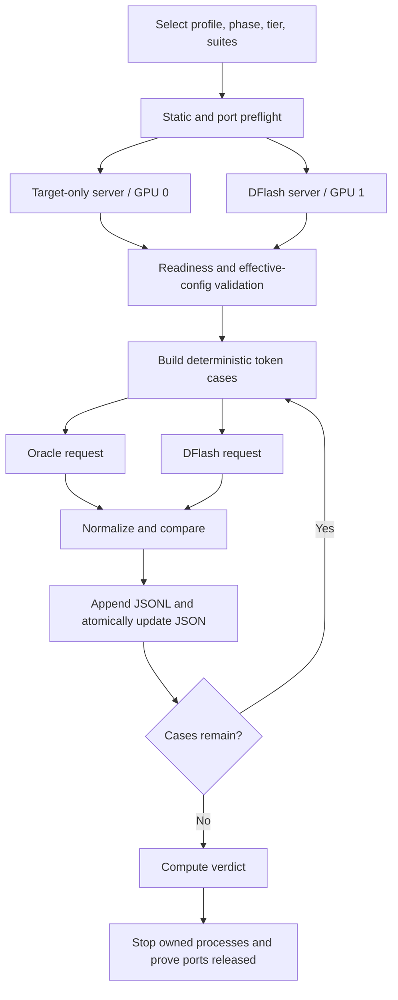

# DFlash generation-correctness testing algorithm

This is the step-by-step method used to test DFlash generation against ordinary
target-only SGLang. The code lives in
[`run_dflash_correctness.py`](run_dflash_correctness.py),
[`dflash_correctness_harness.py`](dflash_correctness_harness.py), and the
test-only [`H200 config`](configs/dflash_generation_h200.json). Results are in
[`results/REPORT.md`](results/REPORT.md).

## Testing principle

The same target checkpoint runs in two modes:

1. **Oracle:** ordinary target-only generation, without speculative decoding.
2. **System under test:** the same target and common settings, with DFlash and
   its draft model enabled.

The oracle is not a fallback or a ground-truth mathematics checker. Both arms
still use the target's normal paged KV cache. Radix prefix reuse is toggled by
the selected phase; request-local target KV caching remains active in both.

Greedy cross-engine output is judged first by exact identity and then, only at
the first shared-prefix mismatch, by the mandatory target-oracle logprob bound.
Sampling is judged by repeatability within each engine and statistical agreement
across engines.



## Algorithm

### 1. Select the finite experiment

Choose:

- a **profile** for model pair, runtime, quantization, and DFlash block size;
- a **phase** controlling radix, overlap scheduling, and CUDA graphs;
- `quick` or `full` **tier**;
- every compatible suite, or an explicit isolation subset.

The main production profile is `fix4_w4a16_int4` with effective DFlash block 8.
Block-1, native block-11, and BF16/BF16 profiles are diagnostic controls.

`full` extends `quick`:

| Dimension | Quick | Full |
|---|---|---|
| Output lengths | 0, 1, 2, 7, 8, 9, 15, 16, 17, 63, 64, 65, 511, 512, 513 | Same |
| Input lengths | 255, 256, 257, 511, 512, 513, 2047, 2048, 2049, 2050, 2051, 4095, 4096, 4097 | Quick + 1023, 1024, 1025, 8191, 8192, 8193, 65535, 65536, 65537 |
| Batch sizes | 1, 2, 3, 7, 8, 9, 16, 17, 32, 48 | Quick + 5, 15, 19, 20, 21, 23, 24, 25, 31, 33, 39, 40, 41, 47 |
| Stream intervals | 1, 7, 8, 16 | Same |
| Sampling draws | 512 | 2,000 |
| Single soak | 513 tokens | 20,481 tokens |
| Concurrent soak | 2 × 65 | 6 × 4,097 |
| Request timeout | 300 s | 1,800 s |

"100%" can only mean all declared finite cases passed, not a proof over every
possible prompt, logit tensor, and scheduler interleaving.

### 2. Run the separate unit/kernel layer

The GPU runner does not automatically run this layer. Run it separately:

```bash
/workspace/original/runtime/venv/bin/python -m unittest discover \
  -s tests -p 'test_*.py'
```

It checks selected finite state spaces for:

- every acceptance length across multiple block and batch sizes;
- first rejection, commit length, bonus token, and packed output;
- finish replay and committed-KV rollback boundaries;
- sampling acceptance/residual output against an independent scalar reference;
- zero-probability rejection and seeded sampling properties;
- draft-ring isolation, wraparound, and alignment;
- SSE, stop, checkpoint, path, prefill, patch, and cleanup behavior.

The persisted H200 discovery run is
[`125/125 passing`](results/20260711-tests-layout-isolation-unit/unit-tests.log).

### 3. Create an isolated evidence directory

The runner accepts only a fresh child of `tests/results/`. It rejects paths
outside that root, the results root itself, and directories containing prior
named artifacts. It copies the exact config into the run
directory before launching servers.

### 4. Run static preflight

Before loading either 32B model, verify:

1. configured Python, model, tokenizer, and draft paths;
2. model config files;
3. consistent checkpoint block-size declarations;
4. installed SGLang markers for alignment, finish/KV hardening, sampling
   guards, open-interval sampling, and stateless seeding;
5. required harness CLI flags;
6. both TCP ports are free.

Marker scanning proves source-marker presence, not functional correctness;
behavior is covered by the unit/kernel and GPU layers.

### 5. Build the paired commands

Both direct `sglang.launch_server` commands use the same target, tokenizer,
attention backend, target KV dtype, context/chunk sizes, deterministic setting,
graph shapes, scheduler limits, seed, cache reporting, and metrics.

The oracle has no speculative algorithm or draft. The DFlash command adds only
the expected draft/quantization/block/window/backend settings. Inherited
environment variables that could silently change the path are removed;
DFlash-only compact-ring variables go only to the system under test.

### 6. Launch and own both servers

Pin target to GPU 0 and DFlash to GPU 1. Start each in an owned process group and
capture complete logs. Readiness requires the health/generation probe, not just
an open socket. Either process exiting or a readiness timeout aborts.

### 7. Prove DFlash activation

Require startup evidence for:

- initialized DFlash worker;
- `draft_kv_ring=True`;
- created compact draft pool;
- expected effective block size;
- agreement between both runtime block flags;
- exactly the expected checkpoint/runtime mismatch warning, or no warning for
  native block size.

There is no non-DFlash fallback.

### 8. Validate effective server state

Fetch `/model_info` and `/server_info`. Common settings and SGLang version must
match. The target must report no speculation/draft. DFlash must report the exact
algorithm, draft, quantization, block/window, and backend. Radix, overlap, and
graphs must match the phase. The harness repeats a sanitized validation as
`preflight-server-pair`.

### 9. Build deterministic exact-token prompts

Load the tokenizer locally. Construct exact-length token arrays from a
deterministic nonperiodic filler corpus, per-case variant, and equation suffix.
Thus `greedy-input-4096` is exactly 4,096 token IDs. Radix forks share an exact
token prefix and use deterministic distinct suffixes.

### 10. Dispatch paired requests

Send target and DFlash requests concurrently with identical input IDs and
sampling settings; only request IDs differ. A separate
[`target GPU A/A runner`](run_target_gpu_control.py) controls for physical GPU
assignment.

### 11. Normalize responses

Require integer `output_ids`, `meta_info`, valid optional text, and requested
prompt IDs. Streaming additionally requires valid SSE objects, final `[DONE]`,
no data afterward, monotonic cumulative output or valid incremental deltas, one
finished record per batch row, and no post-finish emission.

Preserve raw IDs, raw structured finish reason, text, counts, prompt IDs,
cache/speculative telemetry, and a compact chunk audit.

### 12. Apply exact structure plus bounded numerical equivalence

First compute and persist exact equality for output IDs, decoded text, raw finish
reason, prompt-token count, completion-token count, and returned/submitted prompt
IDs. If the entire response is identical, assign `equivalence_verdict=exact`.

If output IDs differ, numerical evaluation is permitted only when finish reason,
prompt count, completion count, and prompt IDs remain exact and both engines
produced a token at the first mismatch. Build:

```text
shared_prefix = input_ids + target_output_ids[:first_mismatch_index]
```

Ask the target-only server for one greedy token from that prefix with
`return_logprob=true`, `top_logprobs_num=5`, and requested-token logprobs for the
target and DFlash alternatives. The full probe response is persisted. Assign
`equivalence_verdict=numerical` only when:

```text
oracle_top_logprob - target_token_logprob <= 0.13
oracle_top_logprob - dflash_token_logprob <= 0.13
```

The replay-selected token is recorded for diagnosis but does not change this
delta predicate. Otherwise assign `equivalence_verdict=failed`. Missing or
malformed logprob evidence is an error. The tolerance is part of the test verdict
only; the target and DFlash sampling parameters are unchanged.

When DFlash emits more than one token, also require:

```text
spec_verify_ct > 0
spec_num_proposed_drafts > 0
```

This proves verification and proposals, not accepted-draft count. Stream and
non-stream results must remain exactly repeatable within each engine. Stop,
prompt, cache, activity, and suite-specific invariants also remain exact.

```text
case_pass =
    (exact_output_ids or bounded_first_mismatch)
    and exact_finish_reason
    and exact_prompt_count
    and exact_completion_count
    and exact_prompt_ids
    and (not speculation_eligible or dflash_activity)
    and exact_within_engine_repeatability
    and suite_specific_checks
```

`exact`, `numerical`, and `failed` counts are reported separately. A numerical
pass is not bitwise equivalence and must never be described as exact-token
identity. Generic equality still does not require cache counts, chunk boundaries,
latencies, or unrelated metadata values to match.

### 13. Execute suites in order

Default order: `greedy`, `stop`, `stream`, `radix`, `native-batch`,
`sampling`, `negative`, `stress`. A non-radix phase omits `radix` by default;
explicitly requesting it is an error.

#### Greedy

Sweep configured output lengths on a 257-token prompt, then input lengths with
17 generated tokens, then one natural EOS-or-length case. Output sweeps also
require exact length finish and empty output at zero. Boundaries cover DFlash
block size, draft window 512, prefill chunk 2,048, and target SWA 4,096.

#### Stop

Generate a matching discovery output, dynamically choose unique non-EOS stop
tokens near positions 0, 5, 7, and 14, test trim/keep, then derive one stop
string. Token-stop raw IDs include the matched token while visible text follows
`no_stop_trim`. The string case asserts expected IDs/finish and cross-engine
text, but not a separately computed expected trimmed string.

#### Stream

Require all four comparisons:

- target stream = target non-stream;
- DFlash stream = DFlash non-stream;
- target = DFlash non-stream;
- target = DFlash stream.

Prompt IDs and DFlash activity must pass; chunk timing/boundaries need not match.

#### Radix prefix reuse

1. Flush both caches.
2. Run cold then warm; integer `cached_tokens` must increase separately on each.
3. Seed a 1,536-token fork with 1,024 shared tokens.
4. Run a second fork; both must report positive cache hits.
5. Run unrelated noise, then reuse the original prompt.
6. Flush again.

Cache counts need not equal across engines, and the final reuse has no separate
telemetry assertion. Content and cache checks are recorded separately.

#### Native batch

For every size, use prompt length `257 + (row mod 3)` and cycle output lengths
`1, 2, 7, 8, 9, 17`. Require response shape/order and exact prompt/output/activity
per row. An indexed SSE batch of eight is also compared directly across engines;
it does not issue extra non-stream requests.

#### Sampling

Use temperature `0.6`, top-p `0.95`, top-k `-1`, and eight output tokens. Across
512 or 2,000 seeds require exact length, more than one unique sequence per
engine, and DFlash activity.

For positions 1–7 (position 0 excluded), compute categorical total variation.
Run 999 deterministic pooled-sample permutations and require observed TV not to
exceed the empirical null bound with `alpha = 0.01 / 7`.

Then:

- duplicate seeds in one native batch require the two engines to have the same
  repeatability boolean; both false is allowed;
- duplicate seeds as independent singleton batches must repeat within each
  engine, while different seeds retain diversity.

Cross-engine same-seed token identity is not required because RNG consumption
can differ between ordinary and speculative paths.

#### Negative guards

DFlash alone receives nine unsupported transforms: `min_p`, frequency,
presence/repetition penalties, `min_new_tokens`, combined top-k/top-p, grammar,
return-logprob, and custom logit processor. Each must return HTTP 400 with the
expected diagnostic. This does not test target rejection.

#### Stress

Run one long paired request and one concurrent native non-streaming batch.
Despite the config name `concurrent_soak_streams`, this is not SSE streaming.
Cross draft-ring/SWA boundaries and exercise committed KV and scheduling.
Liveness without timeout/OOM does not turn a token mismatch into a pass.

### 14. Checkpoint every case

Before a case, write `in_progress`. Afterward:

1. append full case JSON to JSONL;
2. flush and `fsync`;
3. atomically replace aggregate JSON through a temporary file;
4. clear `in_progress` and recompute counts.

The direct harness supports resume/overwrite; the normal pair runner requires a
fresh directory. Resume requires an exact fingerprint match for config hash,
profile, phase, tier, suite order, URLs, sampling count, and permutation count.
Git/model hashes are metadata, not fingerprint inputs. Resume reads aggregate
JSON rather than replaying JSONL.

Failures and non-timeout errors are recorded and later cases continue. A timeout
is recorded, then aborts because a possibly wedged server makes later evidence
unreliable.

### 15. Compute the verdict

```text
summary.ok =
    failed == 0
    and errors == 0
    and skipped == 0
```

One failure makes the harness nonzero. A full claim requires all suites; a
passing subset is only an isolation result. With normal stop selection,
production quick declares 100 cases and full declares 123, both including
preflight.

The outer runner's `status: failed` can therefore mean a complete matrix found
correctness failures, not that servers crashed. Read the structured counts.

### 16. Always clean up owned resources

On every exit path:

1. terminate owned DFlash then target process groups;
2. escalate from `SIGTERM` to `SIGKILL` after the deadline;
3. poll until both ports are bindable;
4. record cleanup attempts/duration/`ports_released`;
5. remove temporary JIT state.

Cleanup failure is recorded and fails closed.

### 17. Localize failures by changing one factor

| Control | Question |
|---|---|
| Graphs/overlap, no radix | Is radix required? |
| Radix, no graphs/overlap | Is asynchronous scheduling required? |
| Fully synchronous eager | Does divergence remain without all three? |
| Native block 11 | Is the block-8 override responsible? |
| Block 1 | Can target verification diverge with zero draft proposals? |
| BF16 target/draft | Is quantization solely responsible? |
| Target-only GPU 0/GPU 1 | Is physical GPU assignment responsible? |

Diagnostics explain a failure; they never convert it into a pass.

## Reproduction

```bash
# Quick production matrix
/workspace/original/runtime/venv/bin/python tests/run_dflash_correctness.py \
  --profile fix4_w4a16_int4 --phase production --tier quick \
  --results-dir tests/results/<unique-quick-run>

# Full production matrix
/workspace/original/runtime/venv/bin/python tests/run_dflash_correctness.py \
  --profile fix4_w4a16_int4 --phase production --tier full \
  --results-dir tests/results/<unique-full-run>

# Declared isolation subset
/workspace/original/runtime/venv/bin/python tests/run_dflash_correctness.py \
  --profile fix4_w4a16_int4 --phase sync_eager --tier quick \
  --suites greedy,stream \
  --results-dir tests/results/<unique-isolation-run>
```

## Historical strict-exact full-matrix result

| Suite | Pass | Fail |
|---|---:|---:|
| Preflight | 1 | 0 |
| Greedy | 25 | 14 |
| Stop | 10 | 0 |
| Stream | 18 | 6 |
| Radix | 9 | 1 |
| Native batch | 7 | 18 |
| Sampling | 3 | 0 |
| Negative guards | 9 | 0 |
| Stress | 0 | 2 |
| **Total** | **82** | **41** |

There were zero errors and zero skips. Under the former exact-token-only
predicate:

> **DFlash was not 100% generation-correct under the exact-token contract.**

This historical artifact is not retroactively reclassified. The numerical
contract requires new target-oracle probes at each first mismatch, which the old
result does not contain. Exact and numerical outcomes from a new run must be
reported separately. See [`results/REPORT.md`](results/REPORT.md) for the
complete historical evidence and limits.

## Current schema-v2 results

The final BF16 production quick matrix completed 100/100 cases with zero
failures, errors, or skips:

| Verdict class | Count |
|---|---:|
| Exact cross-engine | 67 |
| Numerical cross-engine | 16 |
| Other invariant pass | 17 |
| Failed/error/skipped | 0 |

The complete artifacts are in
[`20260711-proofbench-bf16-pure-logprob-delta-production-quick-all`](results/20260711-proofbench-bf16-pure-logprob-delta-production-quick-all/).
All declared suites passed under production radix, overlap scheduling, and CUDA
graphs.

The BF16 sync-eager greedy isolation is deliberately reported separately. It
completed 30/31: 26 exact cross-engine, three numerical cross-engine, one
preflight pass, and one over-bound failure. The failing target token was
`0.136747` below the replay maximum, exceeding the configured `0.13` delta.
See [`20260711-proofbench-bf16-pure-logprob-delta-sync-eager-quick`](results/20260711-proofbench-bf16-pure-logprob-delta-sync-eager-quick/).

The final unit discovery passed 137/137 tests. These results support the finite
production quick matrix only; they do not establish bitwise identity or replace
a schema-v2 full-tier production run.
